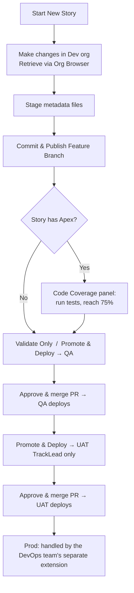

# Salesforce DevOps — Developer Guide

A quick, practical guide to using the **Salesforce DevOps** VS Code extension: how to start a story, publish your work, check code coverage, and promote/deploy through the environments.

---

## 1. What this extension does

It manages your Salesforce story from **feature branch → dev → QA → UAT** using a Copado-style Git flow, so you never touch git commands by hand. Each story:

1. Lives on its own **feature branch** (cut from `main`, which is Prod).
2. Is **published** to the shared `dev` branch.
3. Is **promoted** to QA and then UAT, where the actual Salesforce deployment happens when a pull request is merged.

> **Prod** (the `main` branch) is deployed by the **DevOps team via a separate extension** — this extension takes a story up to **UAT**.

---

## 2. First-time setup

1. **Install the extension**: Extensions view → `…` menu → **Install from VSIX…** → pick `sf-devops-<version>.vsix`.
2. **Open the panel**: click the **Salesforce DevOps** icon in the Activity Bar (left side). You'll see four panels:
   - **Current Story** — your main workspace and action buttons.
   - **Code Coverage** — Apex test coverage gate.
   - **Pipeline Status** / **Environments** — read-only status.
3. **Prerequisites** (already true for most devs):
   - Salesforce CLI (`sf`) installed, and your **dev org authenticated** (you retrieve from it via Org Browser).
   - Git access to the Bitbucket repo (SSH recommended).
4. **Settings** (`Ctrl+,` → search `sfDevops`). Everything below is configurable per project — nothing in this guide's examples (dev/QA/UAT, TrackLead, Jira) is hardcoded:
   | Setting | What it's for | Default |
   |---|---|---|
   | `sfDevops.environments` | The full pipeline, in order. First entry publishes straight from the feature branch (no PR); every later entry is a promote/validate stage. Each entry can set its own branch name, icon, `requiredRole`, and `coverageGate`. | `dev` → `qa` (coverage-gated) → `uat` (requires `TrackLead`) |
   | `sfDevops.roles` | The role names your team uses. | `["developer", "TrackLead"]` |
   | `sfDevops.role` | This user's role — must be one of `sfDevops.roles`. Unlocks **Promote & Deploy** into any environment whose `requiredRole` matches. | `developer` |
   | `sfDevops.gitProvider` / `sfDevops.repoWorkspace` / `sfDevops.repoSlug` | Git host and repo identity for pull requests and pipeline status. Only Bitbucket is implemented today. | `bitbucket` |
   | `sfDevops.ticketSystem` / `sfDevops.ticketKeyPattern` / `sfDevops.ticketBaseUrl` | Which ticketing system story IDs come from, the regex used to recognize one, and an optional link-out. Set `ticketSystem` to `none` to skip format validation entirely. | `jira` |
   | `sfDevops.featureBranchTemplate` / `sfDevops.promotionBranchTemplate` / `sfDevops.validateBranchTemplate` | Branch naming templates (`{storyId}`, `{env}` placeholders). | `feature/{storyId}`, `promotion/{storyId}-to-{env}`, `validate/{storyId}-to-{env}` |
   | `sfDevops.devOrgAlias` | Dev-org alias for the coverage check. Empty = your default `sf` org. | `""` |
   | `sfDevops.coverageThreshold` / `sfDevops.coverageTimeoutSeconds` | Minimum Apex coverage % and how long to wait for tests, before promoting into a coverage-gated environment. | `75`, `600` |
   | `sfDevops.baseBranch` | Branch new feature branches are cut from. | `main` |
   | `sfDevops.sourceRootFolder` | Salesforce DX package directory name, used to detect Apex/metadata changes. | `force-app` |
   | `sfDevops.staleBranchThreshold` | Commits behind base branch before a sync warning appears. | `5` |

   The rest of this guide uses the **default** dev → QA → UAT pipeline and the `developer`/`TrackLead` roles as a running example — substitute your own configured environment and role names throughout.

---

## 3. The overall flow

---

## 4. Starting a story

In the **Current Story** panel:

- **🚀 Start New Story** — enter the story ID (e.g. `SDC-200`). Creates and checks out `feature/SDC-200` from `main`.
- **⏳ Continue with Existing Story** — pick an existing feature branch to resume.

---

## 5. Doing the work & publishing

1. Make your changes **in the dev org** (objects, fields, Apex, FLS, etc.).
2. **Retrieve** them into VS Code using the **Org Browser** (Salesforce Extension Pack).
3. **Stage** the retrieved metadata files in the **Source Control** view.
4. Click **☁ Commit & Publish Feature Branch**. This will:
   - commit your **staged** files,
   - push the **feature branch**, and
   - add your story's changes to the shared **`dev` branch**.

   > No deployment happens here — publishing just gets your work onto the branches. You can Commit & Publish as many times as you like.

---

## 6. Code coverage (only if your story has Apex)

If your feature branch contains Apex classes/triggers, you must pass a **one-time** coverage check before promoting to QA.

In the **Code Coverage** panel:

1. It lists the **Apex classes** detected in your story.
2. Type the **related test class names** (comma or space separated) in the input box.
3. Click **▶ Run Tests & Check Coverage**. It runs those tests **in the dev org** and shows each class's coverage.
4. When every class is **≥ 75%** (and tests pass), the gate is marked ✅ **passed** — and you won't be asked again for this story.

> If you try **Promote & Deploy → QA** before passing, you'll be blocked with an **Open Coverage Panel** button.
> Stories with **no Apex** skip this entirely.

---

## 7. Promoting to the next environment

Once the story is published to `dev`, two buttons appear for the **next environment** (QA first, then UAT):

- **✔ Validate Only** — runs a **check-only** Salesforce validation against the target org. **Nothing is deployed.** Available to everyone. Use it to confirm the deployment will succeed before you promote.
- **🚀 Promote & Deploy** — creates the promotion branch and opens a **pre-filled Pull Request** page (promotion → target env) in your browser. **The deployment runs only after you approve and merge that PR.** The **merge is the deploy button.**

Notes:
- **QA**: both buttons available to everyone.
- **UAT**: **Promote & Deploy** requires the **`TrackLead`** role; **Validate Only** is available to everyone.
- **Prod** is not promoted from this extension — the **DevOps team** deploys to Prod (`main`) via a separate extension.
- Only your **story's changes** are validated/deployed — never anyone else's.

---

## 8. Merge conflicts

If your changes conflict with the target branch, the panel switches to **⚙ Paused — resolve conflicts** and shows which files conflict.

1. Open the **Source Control** view and resolve the conflicts.
2. **Save** the files.
3. Click **▶ Resume** in the panel. (Or **✕ Cancel** to back out.)

The operation continues from where it stopped.

---

## 9. Reading the Story Progress card

| Badge | Meaning |
|---|---|
| **DEV — Published** | Your story's changes are on the `dev` branch. |
| **QA / UAT — Validated / In PR** | A validate branch or an open promotion PR exists (not yet deployed). |
| **QA / UAT — Deployed** | The PR was merged and the story deployed to that org. |
| **Pending** | Not started for that environment yet. |

---

## 10. Button quick-reference

| Button | What it does | Who |
|---|---|---|
| Start New Story | Creates `feature/<ID>` from `uat` | Everyone |
| Continue with Existing Story | Switches to an existing feature branch | Everyone |
| Commit & Publish Feature Branch | Commits staged files, pushes feature, updates `dev` | Everyone |
| Run Tests & Check Coverage | Runs Apex tests in dev org, enforces ≥75% | Everyone |
| Validate Only | Check-only validation against target org (no deploy) | Everyone |
| Promote & Deploy | Opens PR; deploy runs on merge | QA: everyone · UAT: TrackLead |
| Resume / Cancel | Continue or abort a paused (conflicted) operation | Everyone |

---

## 11. Typical end-to-end example

1. **Start New Story** → `SDC-200`.
2. Build in the dev org, **retrieve**, **stage**, **Commit & Publish Feature Branch**.
3. (Apex?) Open **Code Coverage**, enter test classes, **Run** until ✅ ≥75%.
4. **Validate Only — QA** (optional sanity check) → then **Promote & Deploy — QA** → approve & merge the PR → QA deploys.
5. **Promote & Deploy — UAT** (TrackLead) → approve & merge the PR → UAT deploys.

That's this extension's story lifecycle (Prod is deployed by the DevOps team separately). 🎉
