# Salesforce DevOps — Developer Guide

A quick, practical guide to using the **Salesforce DevOps** VS Code extension: how to start a story, publish your work, check code coverage, and promote/deploy through the environments.

---

## 1. What this extension does

It manages your Salesforce story from **feature branch → dev → QA → UAT → Prod** using a Copado-style Git flow, so you never touch git commands by hand — and every validate/deploy action is initiated **from inside VS Code**, with no external CI/CD pipeline required. Each story:

1. Lives on its own **feature branch** (cut from `main`, which is also Prod's branch).
2. Is **published** to the shared `dev` branch.
3. Is **promoted** to QA, then UAT, then Prod — a pull request gates each step (human code review), and the **Deployment Dashboard** runs the actual `sf project deploy` against each org once you're ready, using your own authenticated `sf` CLI session.

You can't skip ahead: promoting into an environment, or Validating/Deploying against it, only works once the stage before it has actually been **deployed** — not just merged. See [§7](#7-promoting-to-the-next-environment) and [§7b](#7b-the-deployment-dashboard).

> **Prod** is a real, gated stage inside this extension by default (branch `main`) — restricted to the **Admin** role. See [§2b](#2b-roles-developer--lead--admin) for the role model.

---

## 2. First-time setup

1. **Install the extension**: Extensions view → `…` menu → **Install from VSIX…** → pick `sf-devops-<version>.vsix`.
2. **Open the panel**: click the **Salesforce DevOps** icon in the Activity Bar (left side). You'll see:
   - **Current Story** — your main workspace, action buttons, and the toolbar (👤 role, 🚀 Deploy, 📋 Audit, ⚙ Setup, ↻ Refresh).
   - **Code Coverage** — Apex test coverage gate.
   - **Environments** — read-only status per environment.
3. **Prerequisites** (already true for most devs):
   - Salesforce CLI (`sf`) installed, and your **dev org authenticated** (you retrieve from it via Org Browser).
   - Git access to the Bitbucket repo (SSH recommended).
4. **Setup check gate** — the **Current Story** panel won't show your story workspace until basic setup checks out: a detected git repo, an `origin` remote, a resolvable repo identity, the configured base + environment branches existing on `origin`, and the source folder being present. Anything **required** that fails blocks the panel and lists concrete fix steps (e.g. "Run: `git remote add origin <url>`"); provider (Bitbucket/GitHub) credentials are checked too but are only a recommendation — PR creation falls back to opening a prefilled browser page without them. Once every required check passes, you confirm once and the gate won't reappear for that workspace unless a required check starts failing again.
5. **Settings** (`Ctrl+,` → search `sfDevops`). Everything below is configurable per project — nothing in this guide's examples (dev/QA/UAT/Prod, Lead/Admin, Jira) is hardcoded:
   | Setting | What it's for | Default |
   |---|---|---|
   | `sfDevops.environments` | The full pipeline, in order. First entry publishes straight from the feature branch (no PR); every later entry is a promote/validate/deploy stage. Each entry can set its own branch name, icon, `requiredRole`, `coverageGate`, `signoffGate`, `deployTestLevel` (default `RunRelevantTests`), and `isProd` (only needed if your prod environment isn't literally named `"prod"` — it decides which stage never allows auto-deploy). | `dev` → `qa` (coverage-gated) → `uat` (requires `Lead`) → `prod` (branch `main`, requires `Admin`) |
   | `sfDevops.roles` | The role names your team uses. | `["Developer", "Lead", "Admin"]` |
   | `sfDevops.role` | **Legacy bootstrap default only.** The role actually in effect is managed via **Change Role** in the toolbar (password-gated for Lead/Admin) — see [§2b](#2b-roles-developer--lead--admin). | `Developer` |
   | `sfDevops.gitProvider` / `sfDevops.repoWorkspace` / `sfDevops.repoSlug` | Git host and repo identity for pull requests and pipeline status. `bitbucket` and `github` are implemented. | `bitbucket` |
   | `sfDevops.ticketSystem` / `sfDevops.ticketKeyPattern` / `sfDevops.ticketBaseUrl` | Which ticketing system story IDs come from, the regex used to recognize one, and an optional link-out. Set `ticketSystem` to `none` to skip format validation entirely. | `jira` |
   | `sfDevops.featureBranchTemplate` / `sfDevops.promotionBranchTemplate` / `sfDevops.validateBranchTemplate` | Branch naming templates (`{storyId}`, `{env}` placeholders). | `feature/{storyId}`, `promotion/{storyId}-to-{env}`, `validate/{storyId}-to-{env}` |
   | `sfDevops.devOrgAlias` | Dev-org alias for the coverage check. Empty = your default `sf` org. | `""` |
   | `sfDevops.coverageThreshold` / `sfDevops.coverageTimeoutSeconds` | Minimum Apex coverage % and how long to wait for tests, before promoting into a coverage-gated environment. | `75`, `600` |
   | `sfDevops.baseBranch` | Branch new feature branches are cut from. | `main` |
   | `sfDevops.sourceRootFolder` | Salesforce DX package directory name, used to detect Apex/metadata changes. | `force-app` |
   | `sfDevops.staleBranchThreshold` | Commits behind base branch before a sync warning appears. | `5` |

   The rest of this guide uses the **default** dev → QA → UAT → Prod pipeline and the `Developer`/`Lead`/`Admin` roles as a running example — substitute your own configured environment and role names throughout.

---

## 2b. Roles: Developer / Lead / Admin

Three roles, by default:

| Role | Can do |
|---|---|
| **Developer** | Everything day-to-day: Start Story, Commit & Publish, Validate Only, Promote up through whatever environments don't require a higher role, run the Coverage check, record sign-offs. **No** access to Setup Check's org-alias editing or **⚙ Configure Settings**. |
| **Lead** | Everything Developer can, plus Promote into any environment requiring `Lead` (UAT, by default) — **except Prod**. Still no config/setup access. |
| **Admin** | Everything, including Promote to **Prod**, editing org aliases in Setup Check, and opening Settings. |

**Changing your role**: click **👤 {role}** in the Current Story panel's toolbar → pick
a role. Elevating to **Lead** or **Admin** requires a password — the first time anyone
elevates, you'll be prompted to set one (stored securely, never in a plain setting or in
source code). Downgrading to Developer never needs it.

**Be clear-eyed about what this is:** this is a convenience/process control, not a hard
security boundary — a VS Code extension can't lock a determined local user out of their
own machine's storage. The real protection for Prod is **org credentials**: only
authenticate Prod's `sf` org alias (Setup Check → 🔑 Authenticate) on machines belonging
to people who should actually be able to deploy there. Role gating in the UI is a
legitimate layer on top of that, not a substitute for it.

---

## 3. The overall flow

```mermaid
flowchart TD
    S0[Setup Check panel:<br/>git/remote/branches + Dev/QA/UAT/Prod<br/>org aliases authenticated] --> S1[Confirm Setup]
    S1 --> A[Start New Story]
    A --> B[Make changes in Dev org<br/>Retrieve via Org Browser]
    B --> C[Stage metadata files]
    C --> D[Commit & Publish Feature Branch<br/>→ cherry-picked straight onto dev, no PR]
    D --> E{Story has Apex?}
    E -- Yes --> F[Code Coverage panel:<br/>auto-detected tests, run in the org<br/>this stage's changes are currently in, reach threshold]
    E -- No --> G
    F --> G[Promote to QA<br/>picks your story from a list, opens a PR]
    G --> H[Approve & merge PR → QA]
    H --> H2{QA signoffGate enabled?}
    H2 -- Yes --> H3[Record QA Sign-off<br/>Current Story panel]
    H2 -- No --> I
    H3 --> I[Deployment Dashboard — QA tab:<br/>check files, Validate, then Deploy]
    I --> I2[sf project deploy start<br/>runs directly against the QA org —<br/>your own sf CLI session, no external CI]
    I2 --> J[Promote to UAT<br/>requires Lead role]
    J --> K[Approve & merge PR → UAT]
    K --> K2{UAT signoffGate enabled?}
    K2 -- Yes --> K3[Record UAT Sign-off]
    K2 -- No --> L
    K3 --> L[Deployment Dashboard — UAT tab:<br/>check files, Validate, then Deploy]
    L --> M[Promote to Prod<br/>requires Admin role]
    M --> N[Approve & merge PR → main]
    N --> O[Deployment Dashboard — Prod tab:<br/>check files, Validate, then Deploy]
```

You can't skip a step in this diagram — Promote to UAT won't run until QA is actually deployed (not just merged), Deploy won't run until Validate has just passed for the exact files you have checked, and so on all the way to Prod.

Two gates are **opt-in per environment**, off by default:
- **Coverage gate** (`sfDevops.environments[].coverageGate`) — blocks promotion into that environment until the Code Coverage panel's threshold passes.
- **Sign-off gate** (`sfDevops.environments[].signoffGate`) — blocks promotion *out of* that environment until someone records a sign-off for it in the Current Story panel (a human "QA/UAT approved this" checkpoint, independent of automated coverage). Enable it per stage — e.g. on `qa` so UAT can't start until QA signs off, and again on `uat` so Prod can't start until UAT signs off.

The actual org deploy (QA/UAT/Prod) always happens via the **Deployment Dashboard**
(`🚀 Deploy` in the Current Story panel toolbar) — it runs `sf project deploy` directly
using your own authenticated `sf` CLI session. **No external CI/CD pipeline is used or
required** — see `CI_CD_SETUP_GUIDE.md` for the one-time org-authentication setup.

---

## 4. Starting a story

In the **Current Story** panel:

- **🚀 Start New Story** — enter a story ID or short description (e.g. `SDC-200`, or free text like `unmanaged-package-changes` if your team doesn't use ticket-shaped IDs). It's automatically cleaned up into a safe branch name (spaces/punctuation collapse to `-`, characters git doesn't allow in a ref are stripped) and upper-cased, then creates and checks out `feature/<ID>` from `main`. If your `sfDevops.ticketKeyPattern` expects a ticket-shaped key (e.g. `PROJ-123`) later, prefer entering an ID in that shape — free text still works for creating the branch, but downstream steps that try to recognize the ticket key back out of the branch name will fall back to the whole ID instead.

  If your **current** story still has something unfinished (an open PR, or a stage that's merged but not deployed), you'll get a warning summarizing what's pending with a **"Continue Anyway"** option — it won't stop you, it's just a "did you mean to leave this behind" check.
- **⏳ Continue with Existing Story** — pick an existing **local** feature branch from a list and switch to it. This is a plain `git checkout`, not a search — the branch must already exist locally (e.g. from a previous `Start New Story`, or `git fetch` + `git checkout` done outside the extension).

Every action you take (start, resume, publish, sync, promote, conflicts) is recorded in a local **audit trail** — see [§13](#13-audit-trail).

---

## 5. Doing the work & publishing

1. Make your changes **in the dev org** (objects, fields, Apex, FLS, etc.).
2. **Retrieve** them into VS Code using the **Org Browser** (Salesforce Extension Pack).
3. **Stage** the retrieved metadata files in the **Source Control** view.
4. Click **☁ Commit & Publish Feature Branch**. This will:
   - commit your **staged** files,
   - push the **feature branch**, and
   - add your story's changes to the shared **`dev` branch**.

   > No deployment happens here — publishing just gets your work onto the branches. You can Commit & Publish as many times as you like.

   Have other, unrelated **unstaged** edits sitting around at the same time (something you're not ready to publish yet)? They're automatically set aside and restored on your feature branch afterward, untouched — only what you staged gets published. You'll see a note in the Output channel when this happens.

**Story Progress keeps you honest about this**: once DEV shows ✅ **Published**, if you make *more* local changes afterward, the badge switches to ⚠️ **"Published — N new change(s) pending"**, showing how many are staged vs. still in progress, with a **commit to dev** link right there — instead of the badge quietly going stale.

---

## 6. Code coverage (only if your story has Apex)

If your feature branch contains Apex classes/triggers, you must pass a **one-time** coverage check before promoting to QA.

In the **Code Coverage** panel:

1. It lists the **Apex classes** detected in your story.
2. Type the **related test class names** (comma or space separated) in the input box.
3. Click **▶ Run Tests & Check Coverage**. It runs those tests **in the dev org** and shows each class's coverage.
4. When every class is **≥ 75%** (and tests pass), the gate is marked ✅ **passed** — and you won't be asked again for this story.

> If you try **Promote → QA** before passing, you'll be blocked with an **Open Coverage Panel** button.
> Stories with **no Apex** skip this entirely.

---

## 7. Promoting to the next environment

Once the story is published to `dev`, two buttons appear for the **next environment** (QA, then UAT, then Prod):

- **✔ Validate Only** — runs a **check-only** Salesforce validation against the target org. **Nothing is deployed.** Available to everyone. Use it to confirm the deployment will succeed before you promote.
- **🚀 Promote** — opens a picker: **pick which story to promote to that environment** from every story currently sitting on the previous stage, ready to move on. This works no matter which branch you currently have checked out — you don't need to switch to a story's branch just to promote it. Pick one → it creates the promotion branch and opens a **pre-filled Pull Request** page in your browser. The PR merge is the **code-review gate** — merging doesn't deploy anything by itself. If nothing's eligible yet, it tells you that instead of showing an empty list.

Once the PR merges, the panel notices and switches that environment's action button to **🚀 Deploy — {env}**, which takes you straight to that environment's tab in the **Deployment Dashboard** — see [§7b](#7b-the-deployment-dashboard) for what to do there. You can't promote *past* an environment until it's actually deployed there, not just merged, and Promote/Validate/Deploy all refuse to run out of order — this is enforced every time, not just a hidden button.

Notes:
- **QA**: both buttons available to everyone.
- **UAT**: **Promote** requires the **Lead** role; **Validate Only** is available to everyone.
- **Prod**: **Promote** requires the **Admin** role; **Validate Only** is available to everyone. Prod's branch is `main` by default — the same branch feature branches are cut from.
- Only your **story's changes** are validated/deployed — never anyone else's.

---

## 7b. The Deployment Dashboard

Open it from **🚀 Deploy** in the toolbar, or by clicking the **🚀** link next to an environment in Story Progress once it's "Merged — ready to deploy" (which jumps straight to the right tab). One tab per environment (QA, UAT, Prod).

Each tab is split into two halves:

- **Left — what's pending.** Every file merged into that environment's branch but not yet deployed, grouped by Salesforce metadata type (Apex Classes, Custom Objects, LWC, …) with a checkbox per file. A dropdown above it filters the list down to one story/PR at a time. **Select all** / **Select none** links (respect the current filter) let you grab everything in one click, or narrow to a single story and cherry-pick just that.
- **Right — the diff.** Click any file's name (not its checkbox) to see a color-coded, line-by-line diff of what's about to change, right there — no need to leave the panel.

**To actually deploy:**
1. Check the file(s) you want (or use Select all).
2. Click **🔍 Validate**. This runs a real check-only Salesforce validation — the summary line under the tree tells you what to do next ("Next: click Validate.").
3. Once it passes, **🚀 Deploy** unlocks for that *exact* selection — the summary line switches to "Ready — click Deploy." **Deploy stays locked/disabled until this happens**, even if you have permission — this is deliberate, not a bug. Uncheck or change even one file afterward and it re-locks; re-validate to unlock again.
4. Click **🚀 Deploy** to run the real `sf project deploy`.

**Auto-deploy on success**: check this box before clicking Validate, and a passing Validate immediately chains into a real Deploy for you — one click instead of two. **Not available on Prod** — Prod always needs the explicit manual Deploy click, checkbox or not.

If nothing's been deployed through this dashboard for an environment yet, you'll see **Validate ALL** / **Deploy ALL** buttons instead of a tree (there's nothing to individually pick yet) — same Validate-before-Deploy rule applies.

Every Validate/Deploy prints what it's doing to the **"Salesforce DevOps" output channel** (`View → Output`, pick it from the dropdown) — which files it's picking up, and whether it passed or failed — so you're never just watching a spinner.

---

## 8. Keeping your branch in sync

Long-lived feature branches drift behind `main` (or your configured `sfDevops.baseBranch`) as other stories merge. This extension surfaces that instead of letting it become a surprise conflict during a promotion:

- **On startup**, if your current feature branch is more than `sfDevops.staleBranchThreshold` commits (default `5`) behind the base branch, you're prompted **"Sync Now"** or **"Later."**
- **🔄 Sync Branch with Dev** (available any time on a feature branch) rebases your branch onto the latest base branch and pushes the result.
- Requires a clean working tree. If you have uncommitted changes when you try Sync (or Deploy, or Start Story, or the 2GP packaging command), you'll get a warning with a **"Review Changes"** button that opens the native Source Control view — real diffs, staging, discard, commit, right there, without leaving the flow. If some of what's uncommitted is already **staged**, you'll also see **"Commit to Dev"**, which runs Commit & Publish for you on the spot.
- If the rebase hits conflicts, it stops mid-rebase; resolve them and run `git rebase --continue` yourself (this one isn't wired into the panel's Resume/Cancel flow — that flow is for cherry-pick conflicts, see [§9](#9-merge-conflicts)), or `git rebase --abort` to back out.

---

## 9. Merge conflicts

If your changes conflict with the target branch, the panel switches to **⚙ Paused — resolve conflicts** and shows which files conflict.

1. Open the **Source Control** view and resolve the conflicts.
2. **Save** the files.
3. Click **▶ Resume** in the panel. (Or **✕ Cancel** to back out.)

The operation continues from where it stopped.

---

## 10. Reading the Story Progress card

| Badge | Meaning |
|---|---|
| **DEV — Published** | Your story's changes are on the `dev` branch. |
| **DEV — ⚠️ Published — N new change(s) pending** | You've made more local changes since publishing — some staged, some maybe not. Click **commit to dev** right on the badge to publish them. |
| **QA / UAT / Prod — Validated / In PR** | A validate branch or an open promotion PR exists (not yet merged). |
| **QA / UAT / Prod — Merged — ready to deploy** | The PR merged into that environment's branch, but no deploy has caught up to it yet — click the 🚀 link (or the action button below) to open the Deployment Dashboard for that environment. |
| **QA / UAT / Prod — Deployed** | A real `sf project deploy` (run from the Deployment Dashboard) has actually caught up to this story's merged commit. |
| **Pending** | Not started for that environment yet. |

---

## 11. Button quick-reference

| Button | What it does | Who |
|---|---|---|
| Start New Story | Creates `feature/<ID>` from `main`; warns (doesn't block) if your current story has unfinished work | Everyone |
| Continue with Existing Story | Switches to an existing **local** feature branch | Everyone |
| Commit & Publish Feature Branch | Commits staged files, pushes feature, updates `dev`; auto-preserves other in-progress edits | Everyone |
| Run Tests & Check Coverage | Runs Apex tests in dev org, enforces ≥75% | Everyone |
| Validate Only | Check-only validation against target org (no deploy) | Everyone |
| Promote | Opens a picker of every story eligible to promote to that environment — locked until the previous stage is deployed | QA: everyone · UAT: Lead · Prod: Admin |
| 🔍 Validate (Deployment Dashboard) | Check-only validation against the checked selection; unlocks Deploy on success | QA/UAT: everyone · Prod: Admin |
| 🚀 Deploy (Deployment Dashboard) | Runs the real `sf project deploy` — locked until Validate just passed for the exact same selection | QA/UAT: everyone · Prod: Admin (never auto-deploys) |
| Auto-deploy on success (Deployment Dashboard) | Chains Deploy right after a passing Validate, one click | QA/UAT: everyone · unavailable on Prod |
| Sync Branch with Dev | Rebases your feature branch onto the base branch and pushes | Everyone |
| Resume / Cancel | Continue or abort a paused (conflicted) operation | Everyone |
| 👤 Change Role | Switches your effective role | Everyone (Lead/Admin need the password) |
| 📋 Audit / 🚀 Deploy / ⚙ Setup (toolbar) | Opens the audit log / Deployment Dashboard / Setup Check | Everyone (Setup Check org-alias editing is Admin-only) |

---

## 12. Typical end-to-end example

1. **Start New Story** → `SDC-200`.
2. Build in the dev org, **retrieve**, **stage**, **Commit & Publish Feature Branch**.
3. (Apex?) Open **Code Coverage**, enter test classes, **Run** until ✅ ≥75%.
4. **Validate Only — QA** (optional sanity check) → **Promote — QA** → pick `SDC-200` from the picker → approve & merge the PR → **🚀 Deploy — QA** link appears in Story Progress → in the Dashboard: check the files → **Validate** → **Deploy**.
5. **Promote — UAT** (Lead) → pick `SDC-200` → approve & merge the PR → Validate → Deploy in the Dashboard's UAT tab.
6. **Promote — Prod** (Admin) → pick `SDC-200` → approve & merge the PR into `main` → Validate → Deploy in the Dashboard's Prod tab.

That's this extension's full story lifecycle, Dev through Prod, entirely from VS Code. 🎉

---

## 13. Audit trail

Every meaningful action — Start New Story, Continue with Existing Story, Commit & Publish, Sync Branch, Promote / Validate Only, Deployment Dashboard deploys/validations, sign-off recordings, and conflicts — writes one entry to a **local, per-clone** audit log (it lives inside your `.git` directory, so it isn't pushed or shared with teammates).

- Click **📋 Audit** in the Current Story panel toolbar, or run **`Ctrl+Shift+P` → View Audit Trail**, to open it in a VS Code editor tab (not your browser — it stays inside VS Code).
- Each entry records the operation, story ID, branch, outcome (success/failure/conflict), a one-line summary, and operation-specific details (e.g. commit message, changed files, conflict list, or the error message on failure).
- It's local-only and best-effort — if writing to it ever fails, the underlying git operation still completes; the audit trail never blocks your work.

**Finding what you need in a large log:**

| Control | What it does |
|---|---|
| Search box (or press `/`) | Free-text filters across timestamp, operation, story ID, branch, target env, outcome, summary, commit message, error text, conflicts, and changed-file paths. Matches highlight in the entry title. `Esc` clears it. |
| Operation dropdown | Narrow to one action (e.g. only **Promote**). |
| ✅ / ⚠️ / ❌ pills | Click to show only Success / Conflict / Failure; click again to clear. Combines with the search box and operation dropdown (all three narrow together). |
| Expand all / Collapse all | Open or close every entry's detail body at once. |
| Clear filters | Resets search, operation, and outcome back to "show everything." |
| Entry count | The header shows `(shown of total)` whenever a filter is narrowing the list. |

Each entry's outcome also gets a color-coded callout stripe and pill (green/amber/red for success/conflict/failure) so you can scan the list visually before even reading text.

Use it to answer "what did Commit & Publish actually do to my branch?" or to see the exact error message from a past failure without having to reproduce it — search for the story ID or a snippet of the error text and it'll surface immediately.

---

## 14. Troubleshooting: story ID / branch-name mismatches

If **Commit & Publish**, **Promote**, or **Validate Only** fails with a git error mentioning a branch name that looks **doubled** (e.g. `origin/feature/feature/SOMETHING`) or otherwise doesn't match what you expect:

- The extension re-derives your story ID from the **current branch name** using `sfDevops.ticketKeyPattern` (default: a `PROJECT-123`-shaped key). If that pattern is very permissive (e.g. `\S.*`, matching almost anything), double-check it isn't capturing more of the branch name than intended — extraction always runs against the branch name **with the `feature/` prefix already removed**, but an overly broad pattern can still grab trailing text you didn't expect (e.g. `IB-123-extra-notes` instead of `IB-123`).
- If the branch was created **outside this extension** (manually via `git checkout -b`) with a name that doesn't match your ticket pattern at all, the extension falls back to the branch name itself (minus the `feature/` prefix) as the story ID — which is usually fine, but means your "story ID" in the audit trail / commit messages will be that raw branch suffix rather than a clean ticket key.
- Check the error against the **📋 audit trail** (§13) — the failure entry records the exact command context, which is more informative than the notification toast alone.
- If you're actively developing this extension: remember the **installed** extension and the **compiled `out/`** in this repo are separate copies. After editing `.ts` source, run `npm run compile` (or `npm run package` to rebuild the `.vsix`), then reinstall/reload — editing source alone does not change what's running in your VS Code window.

---

## 15. 2GP Packaging Release Gate (new in v3.0.1)

A **second, occasional track**, separate from the sprint flow above — it's how a batch of UAT-approved work gets turned into a 2GP package beta. It doesn't touch `sfDevops.environments`/`baseBranch` at all; everything it needs lives under `sfDevops.packaging` and two related settings.

**Command:** `Ctrl+Shift+P` → **SF-Ops: Prepare 2GP Beta from UAT**

What it does, in order:
1. Compares `origin/<packagingSourceBranch>` (defaults to your `uat` environment's branch) against `origin/packageBaselineBranch` (default `2gp-main`).
2. Creates `2gp-beta/vX.Y.Z`, cut fresh from the baseline.
3. Sorts every changed file under `sourceBase` into one of three buckets:
   - **`excludedMetadata`** glob matches → skipped entirely.
   - **`patchOverrides`** glob matches → copied to `unmanagedTarget`.
   - everything else → copied to `managedTarget`.
4. Bumps the package version in `sfdx-project.json` (you pick patch/minor/major) and writes `docs/releases/vX.Y.Z-RELEASE-NOTES.md` — categorized file lists plus every commit (and any recognized story/ticket ID) between the two branches.
5. Commits, pushes `2gp-beta/vX.Y.Z`, and opens a PR back to the baseline with the release notes as the PR body. If no Git host credentials are stored yet, it prompts once (then remembers) — if it still can't create the PR via the API, it falls back to opening a prefilled browser page instead.

**Settings** (`Ctrl+,` → search `sfDevops.packag`):

| Setting | What it's for | Default |
|---|---|---|
| `sfDevops.packageBaselineBranch` | The packaging baseline — beta branches are cut from here, PRs target here. | `2gp-main` |
| `sfDevops.packagingSourceBranch` | Branch compared against the baseline. Empty = your `uat` environment's branch. | `""` |
| `sfDevops.packagingRequiredRole` | Role required to run the command. Empty = anyone. | `""` |
| `sfDevops.packaging.sourceBase` | Standard flat-structure root compared between branches. | `force-app/main/default` |
| `sfDevops.packaging.managedTarget` / `unmanagedTarget` | Destination folders on the beta branch. | `force-app/managed/main/default`, `force-app/unmanaged/main/default` |
| `sfDevops.packaging.patchOverrides` | Globs routed to `unmanagedTarget` (patch overrides, server-error workarounds, custom configs). | see settings default |
| `sfDevops.packaging.excludedMetadata` | Globs left out of the beta entirely. | `**/profiles/**`, `**/settings/**` |
| `sfDevops.packaging.docsDirectory` | Where the generated release notes go. | `docs/releases` |
| `sfDevops.packaging.packageName` | Which `packageDirectories` entry in `sfdx-project.json` to version-bump. Empty = first one with a `versionNumber`. | `""` |

> This command creates a real branch, pushes it, and opens a real PR. Review the confirmation dialog's summary before accepting.
