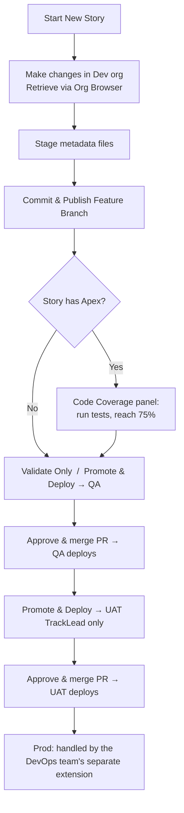

# Salesforce DevOps — Developer Guide

A quick, practical guide to using the **Salesforce DevOps** VS Code extension: how to start a story, publish your work, check code coverage, and promote/deploy through the environments.

---

## 1. What this extension does

It manages your Salesforce story from **feature branch → dev → QA → UAT** using a Copado-style Git flow, so you never touch git commands by hand. Each story:

1. Lives on its own **feature branch** (cut from `main`, which is Prod).
2. Is **published** to the shared `dev` branch.
3. Is **promoted** to QA and then UAT, where the actual Salesforce deployment happens when a pull request is merged.

> **Prod** (the `main` branch) is deployed by the **DevOps team via a separate extension** — this extension takes a story up to **UAT**.

---

## 2. First-time setup

1. **Install the extension**: Extensions view → `…` menu → **Install from VSIX…** → pick `sf-devops-<version>.vsix`.
2. **Open the panel**: click the **Salesforce DevOps** icon in the Activity Bar (left side). You'll see four panels:
   - **Current Story** — your main workspace and action buttons.
   - **Code Coverage** — Apex test coverage gate.
   - **Pipeline Status** / **Environments** — read-only status.
3. **Prerequisites** (already true for most devs):
   - Salesforce CLI (`sf`) installed, and your **dev org authenticated** (you retrieve from it via Org Browser).
   - Git access to the Bitbucket repo (SSH recommended).
4. **Setup check gate** — the **Current Story** panel won't show your story workspace until basic setup checks out: a detected git repo, an `origin` remote, a resolvable repo identity, the configured base + environment branches existing on `origin`, and the source folder being present. Anything **required** that fails blocks the panel and lists concrete fix steps (e.g. "Run: `git remote add origin <url>`"); provider (Bitbucket/GitHub) credentials are checked too but are only a recommendation — PR creation falls back to opening a prefilled browser page without them. Once every required check passes, you confirm once and the gate won't reappear for that workspace unless a required check starts failing again.
5. **Settings** (`Ctrl+,` → search `sfDevops`). Everything below is configurable per project — nothing in this guide's examples (dev/QA/UAT, TrackLead, Jira) is hardcoded:
   | Setting | What it's for | Default |
   |---|---|---|
   | `sfDevops.environments` | The full pipeline, in order. First entry publishes straight from the feature branch (no PR); every later entry is a promote/validate stage. Each entry can set its own branch name, icon, `requiredRole`, and `coverageGate`. | `dev` → `qa` (coverage-gated) → `uat` (requires `TrackLead`) |
   | `sfDevops.roles` | The role names your team uses. | `["developer", "TrackLead"]` |
   | `sfDevops.role` | This user's role — must be one of `sfDevops.roles`. Unlocks **Promote & Deploy** into any environment whose `requiredRole` matches. | `developer` |
   | `sfDevops.gitProvider` / `sfDevops.repoWorkspace` / `sfDevops.repoSlug` | Git host and repo identity for pull requests and pipeline status. `bitbucket` and `github` are implemented. | `bitbucket` |
   | `sfDevops.ticketSystem` / `sfDevops.ticketKeyPattern` / `sfDevops.ticketBaseUrl` | Which ticketing system story IDs come from, the regex used to recognize one, and an optional link-out. Set `ticketSystem` to `none` to skip format validation entirely. | `jira` |
   | `sfDevops.featureBranchTemplate` / `sfDevops.promotionBranchTemplate` / `sfDevops.validateBranchTemplate` | Branch naming templates (`{storyId}`, `{env}` placeholders). | `feature/{storyId}`, `promotion/{storyId}-to-{env}`, `validate/{storyId}-to-{env}` |
   | `sfDevops.devOrgAlias` | Dev-org alias for the coverage check. Empty = your default `sf` org. | `""` |
   | `sfDevops.coverageThreshold` / `sfDevops.coverageTimeoutSeconds` | Minimum Apex coverage % and how long to wait for tests, before promoting into a coverage-gated environment. | `75`, `600` |
   | `sfDevops.baseBranch` | Branch new feature branches are cut from. | `main` |
   | `sfDevops.sourceRootFolder` | Salesforce DX package directory name, used to detect Apex/metadata changes. | `force-app` |
   | `sfDevops.staleBranchThreshold` | Commits behind base branch before a sync warning appears. | `5` |

   The rest of this guide uses the **default** dev → QA → UAT pipeline and the `developer`/`TrackLead` roles as a running example — substitute your own configured environment and role names throughout.

---

## 3. The overall flow

---

## 4. Starting a story

In the **Current Story** panel:

- **🚀 Start New Story** — enter a story ID or short description (e.g. `SDC-200`, or free text like `unmanaged-package-changes` if your team doesn't use ticket-shaped IDs). It's automatically cleaned up into a safe branch name (spaces/punctuation collapse to `-`, characters git doesn't allow in a ref are stripped) and upper-cased, then creates and checks out `feature/<ID>` from `main`. If your `sfDevops.ticketKeyPattern` expects a ticket-shaped key (e.g. `PROJ-123`) later, prefer entering an ID in that shape — free text still works for creating the branch, but downstream steps that try to recognize the ticket key back out of the branch name will fall back to the whole ID instead.
- **⏳ Continue with Existing Story** — pick an existing **local** feature branch from a list and switch to it. This is a plain `git checkout`, not a search — the branch must already exist locally (e.g. from a previous `Start New Story`, or `git fetch` + `git checkout` done outside the extension).

Every action you take (start, resume, publish, sync, promote, conflicts) is recorded in a local **audit trail** — see [§13](#13-audit-trail).

---

## 5. Doing the work & publishing

1. Make your changes **in the dev org** (objects, fields, Apex, FLS, etc.).
2. **Retrieve** them into VS Code using the **Org Browser** (Salesforce Extension Pack).
3. **Stage** the retrieved metadata files in the **Source Control** view.
4. Click **☁ Commit & Publish Feature Branch**. This will:
   - commit your **staged** files,
   - push the **feature branch**, and
   - add your story's changes to the shared **`dev` branch**.

   > No deployment happens here — publishing just gets your work onto the branches. You can Commit & Publish as many times as you like.

---

## 6. Code coverage (only if your story has Apex)

If your feature branch contains Apex classes/triggers, you must pass a **one-time** coverage check before promoting to QA.

In the **Code Coverage** panel:

1. It lists the **Apex classes** detected in your story.
2. Type the **related test class names** (comma or space separated) in the input box.
3. Click **▶ Run Tests & Check Coverage**. It runs those tests **in the dev org** and shows each class's coverage.
4. When every class is **≥ 75%** (and tests pass), the gate is marked ✅ **passed** — and you won't be asked again for this story.

> If you try **Promote & Deploy → QA** before passing, you'll be blocked with an **Open Coverage Panel** button.
> Stories with **no Apex** skip this entirely.

---

## 7. Promoting to the next environment

Once the story is published to `dev`, two buttons appear for the **next environment** (QA first, then UAT):

- **✔ Validate Only** — runs a **check-only** Salesforce validation against the target org. **Nothing is deployed.** Available to everyone. Use it to confirm the deployment will succeed before you promote.
- **🚀 Promote & Deploy** — creates the promotion branch and opens a **pre-filled Pull Request** page (promotion → target env) in your browser. **The deployment runs only after you approve and merge that PR.** The **merge is the deploy button.**

Notes:
- **QA**: both buttons available to everyone.
- **UAT**: **Promote & Deploy** requires the **`TrackLead`** role; **Validate Only** is available to everyone.
- **Prod** is not promoted from this extension — the **DevOps team** deploys to Prod (`main`) via a separate extension.
- Only your **story's changes** are validated/deployed — never anyone else's.

---

## 8. Keeping your branch in sync

Long-lived feature branches drift behind `main` (or your configured `sfDevops.baseBranch`) as other stories merge. This extension surfaces that instead of letting it become a surprise conflict during a promotion:

- **On startup**, if your current feature branch is more than `sfDevops.staleBranchThreshold` commits (default `5`) behind the base branch, you're prompted **"Sync Now"** or **"Later."**
- **🔄 Sync Branch with Dev** (available any time on a feature branch) rebases your branch onto the latest base branch and pushes the result.
- Requires a clean working tree — commit or stash first. If the rebase hits conflicts, it stops mid-rebase; resolve them and run `git rebase --continue` yourself (this one isn't wired into the panel's Resume/Cancel flow — that flow is for cherry-pick conflicts, see [§9](#9-merge-conflicts)), or `git rebase --abort` to back out.

---

## 9. Merge conflicts

If your changes conflict with the target branch, the panel switches to **⚙ Paused — resolve conflicts** and shows which files conflict.

1. Open the **Source Control** view and resolve the conflicts.
2. **Save** the files.
3. Click **▶ Resume** in the panel. (Or **✕ Cancel** to back out.)

The operation continues from where it stopped.

---

## 10. Reading the Story Progress card

| Badge | Meaning |
|---|---|
| **DEV — Published** | Your story's changes are on the `dev` branch. |
| **QA / UAT — Validated / In PR** | A validate branch or an open promotion PR exists (not yet deployed). |
| **QA / UAT — Deployed** | The PR was merged and the story deployed to that org. |
| **Pending** | Not started for that environment yet. |

---

## 11. Button quick-reference

| Button | What it does | Who |
|---|---|---|
| Start New Story | Creates `feature/<ID>` from `main` | Everyone |
| Continue with Existing Story | Switches to an existing **local** feature branch | Everyone |
| Commit & Publish Feature Branch | Commits staged files, pushes feature, updates `dev` | Everyone |
| Run Tests & Check Coverage | Runs Apex tests in dev org, enforces ≥75% | Everyone |
| Validate Only | Check-only validation against target org (no deploy) | Everyone |
| Promote & Deploy | Opens PR; deploy runs on merge | QA: everyone · UAT: TrackLead |
| Sync Branch with Dev | Rebases your feature branch onto the base branch and pushes | Everyone |
| Resume / Cancel | Continue or abort a paused (conflicted) operation | Everyone |
| 📋 audit trail (footer link) | Opens the local audit log — see [§13](#13-audit-trail) | Everyone |

---

## 12. Typical end-to-end example

1. **Start New Story** → `SDC-200`.
2. Build in the dev org, **retrieve**, **stage**, **Commit & Publish Feature Branch**.
3. (Apex?) Open **Code Coverage**, enter test classes, **Run** until ✅ ≥75%.
4. **Validate Only — QA** (optional sanity check) → then **Promote & Deploy — QA** → approve & merge the PR → QA deploys.
5. **Promote & Deploy — UAT** (TrackLead) → approve & merge the PR → UAT deploys.

That's this extension's story lifecycle (Prod is deployed by the DevOps team separately). 🎉

---

## 13. Audit trail

Every meaningful action — Start New Story, Continue with Existing Story, Commit & Publish, Sync Branch, Promote & Deploy / Validate Only, and conflicts — writes one entry to a **local, per-clone** audit log (it lives inside your `.git` directory, so it isn't pushed or shared with teammates).

- Click the **📋 audit trail** link in the Current Story panel footer, or run **`Ctrl+Shift+P` → SF-Ops: View Audit Log**, to open it as an HTML page in your browser.
- Each entry records the operation, story ID, branch, outcome (success/failure/conflict), a one-line summary, and operation-specific details (e.g. commit message, changed files, conflict list, or the error message on failure).
- It's local-only and best-effort — if writing to it ever fails, the underlying git operation still completes; the audit trail never blocks your work.

**Finding what you need in a large log:**

| Control | What it does |
|---|---|
| Search box (or press `/`) | Free-text filters across timestamp, operation, story ID, branch, target env, outcome, summary, commit message, error text, conflicts, and changed-file paths. Matches highlight in the entry title. `Esc` clears it. |
| Operation dropdown | Narrow to one action (e.g. only **Promote & Deploy**). |
| ✅ / ⚠️ / ❌ pills | Click to show only Success / Conflict / Failure; click again to clear. Combines with the search box and operation dropdown (all three narrow together). |
| Expand all / Collapse all | Open or close every entry's detail body at once. |
| Clear filters | Resets search, operation, and outcome back to "show everything." |
| Entry count | The header shows `(shown of total)` whenever a filter is narrowing the list. |

Each entry's outcome also gets a color-coded callout stripe and pill (green/amber/red for success/conflict/failure) so you can scan the list visually before even reading text.

Use it to answer "what did Commit & Publish actually do to my branch?" or to see the exact error message from a past failure without having to reproduce it — search for the story ID or a snippet of the error text and it'll surface immediately.

---

## 14. Troubleshooting: story ID / branch-name mismatches

If **Commit & Publish**, **Promote & Deploy**, or **Validate Only** fails with a git error mentioning a branch name that looks **doubled** (e.g. `origin/feature/feature/SOMETHING`) or otherwise doesn't match what you expect:

- The extension re-derives your story ID from the **current branch name** using `sfDevops.ticketKeyPattern` (default: a `PROJECT-123`-shaped key). If that pattern is very permissive (e.g. `\S.*`, matching almost anything), double-check it isn't capturing more of the branch name than intended — extraction always runs against the branch name **with the `feature/` prefix already removed**, but an overly broad pattern can still grab trailing text you didn't expect (e.g. `IB-123-extra-notes` instead of `IB-123`).
- If the branch was created **outside this extension** (manually via `git checkout -b`) with a name that doesn't match your ticket pattern at all, the extension falls back to the branch name itself (minus the `feature/` prefix) as the story ID — which is usually fine, but means your "story ID" in the audit trail / commit messages will be that raw branch suffix rather than a clean ticket key.
- Check the error against the **📋 audit trail** (§13) — the failure entry records the exact command context, which is more informative than the notification toast alone.
- If you're actively developing this extension: remember the **installed** extension and the **compiled `out/`** in this repo are separate copies. After editing `.ts` source, run `npm run compile` (or `npm run package` to rebuild the `.vsix`), then reinstall/reload — editing source alone does not change what's running in your VS Code window.

---

## 15. 2GP Packaging Release Gate (new in v3.0.1)

A **second, occasional track**, separate from the sprint flow above — it's how a batch of UAT-approved work gets turned into a 2GP package beta. It doesn't touch `sfDevops.environments`/`baseBranch` at all; everything it needs lives under `sfDevops.packaging` and two related settings.

**Command:** `Ctrl+Shift+P` → **SF-Ops: Prepare 2GP Beta from UAT**

What it does, in order:
1. Compares `origin/<packagingSourceBranch>` (defaults to your `uat` environment's branch) against `origin/packageBaselineBranch` (default `2gp-main`).
2. Creates `2gp-beta/vX.Y.Z`, cut fresh from the baseline.
3. Sorts every changed file under `sourceBase` into one of three buckets:
   - **`excludedMetadata`** glob matches → skipped entirely.
   - **`patchOverrides`** glob matches → copied to `unmanagedTarget`.
   - everything else → copied to `managedTarget`.
4. Bumps the package version in `sfdx-project.json` (you pick patch/minor/major) and writes `docs/releases/vX.Y.Z-RELEASE-NOTES.md` — categorized file lists plus every commit (and any recognized story/ticket ID) between the two branches.
5. Commits, pushes `2gp-beta/vX.Y.Z`, and opens a PR back to the baseline with the release notes as the PR body. If no Git host credentials are stored yet, it prompts once (then remembers) — if it still can't create the PR via the API, it falls back to opening a prefilled browser page instead.

**Settings** (`Ctrl+,` → search `sfDevops.packag`):

| Setting | What it's for | Default |
|---|---|---|
| `sfDevops.packageBaselineBranch` | The packaging baseline — beta branches are cut from here, PRs target here. | `2gp-main` |
| `sfDevops.packagingSourceBranch` | Branch compared against the baseline. Empty = your `uat` environment's branch. | `""` |
| `sfDevops.packagingRequiredRole` | Role required to run the command. Empty = anyone. | `""` |
| `sfDevops.packaging.sourceBase` | Standard flat-structure root compared between branches. | `force-app/main/default` |
| `sfDevops.packaging.managedTarget` / `unmanagedTarget` | Destination folders on the beta branch. | `force-app/managed/main/default`, `force-app/unmanaged/main/default` |
| `sfDevops.packaging.patchOverrides` | Globs routed to `unmanagedTarget` (patch overrides, server-error workarounds, custom configs). | see settings default |
| `sfDevops.packaging.excludedMetadata` | Globs left out of the beta entirely. | `**/profiles/**`, `**/settings/**` |
| `sfDevops.packaging.docsDirectory` | Where the generated release notes go. | `docs/releases` |
| `sfDevops.packaging.packageName` | Which `packageDirectories` entry in `sfdx-project.json` to version-bump. Empty = first one with a `versionNumber`. | `""` |

> This command creates a real branch, pushes it, and opens a real PR. Review the confirmation dialog's summary before accepting.
